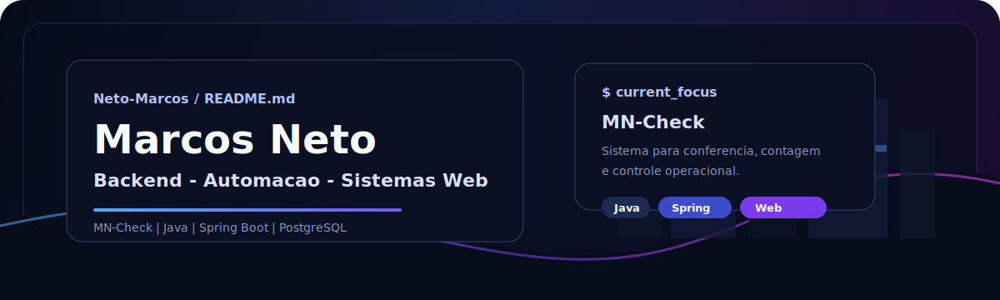

  

<h2 align="center">Ola, eu sou Marcos Neto</h2>

  
  
  

---

## Sobre mim

Sou desenvolvedor em formacao com foco em **backend, automacao e sistemas web para empresas**. Meu objetivo e transformar problemas reais em sistemas uteis, com backend organizado, interface clara e fluxo operacional simples para quem usa.

- Atualmente meu foco principal e o **MN-Check**.
- Gosto de construir projetos que resolvem dores reais de operacao.
- Estou evoluindo em Java, Spring Boot, PostgreSQL, HTML, CSS e JavaScript.
- Meu portfolio apresenta o MN-Check como produto principal.

---

## Projeto principal

<table>
  <tr>
    <td width="58%">
      <h3>MN-Check</h3>
      
Sistema para conferencia, separacao, contagem e acompanhamento de divergencias em operacoes de expedicao.

      <ul>
        <li>Leitura e validacao de codigos.</li>
        <li>Controle de mapas, itens conferidos e finalizados.</li>
        <li>Upload e leitura de PDFs para apoiar o fluxo operacional.</li>
        <li>Dashboard com visao geral da operacao.</li>
      </ul>
    </td>
    <td width="42%" align="center">
      
    </td>
  </tr>
</table>

---

## Linguagens e ferramentas

  
  
  
  
  
  
  
  

---

## GitHub stats

  
  

  

---

## Contato

  
  
  

