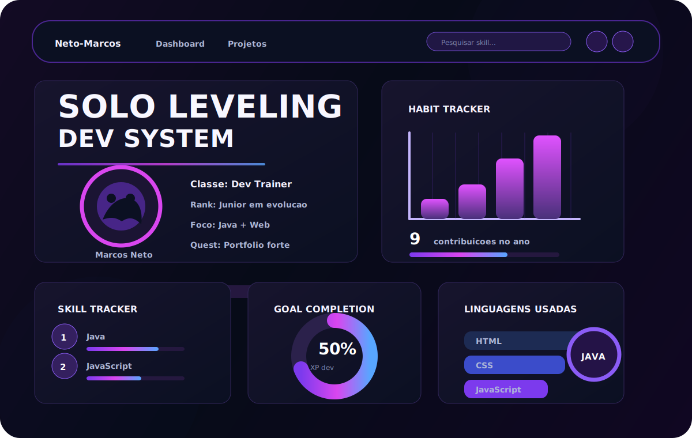

<p align="center">
  
</p>

<p align="center">
  <a href="https://github.com/Neto-Marcos">
    
  </a>
  
  
</p>

---

## Sobre Mim

```yaml
nome: Marcos Neto
usuario: Neto-Marcos
funcao: Desenvolvedor em evolucao
mentalidade: "Bons fundamentos, codigo limpo e evolucao constante"
objetivo_trainer: "Subir de nivel com um projeto, um commit e uma batalha por vez"
estilo_favorito: "Dark UI, ferramentas uteis e energia Pokemon"
```

- Atualmente estou aprimorando minhas habilidades em desenvolvimento de software e construindo meu portfolio.
- Gosto de transformar ideias em projetos praticos, com interfaces simples e organizadas.
- Aprendo melhor colocando a mao no codigo: pequenas iteracoes, codigo real e progresso visivel.
- Referencia Pokemon do dia: cada bug e so um encontro selvagem antes da proxima insignia.

---

## Cartao de Treinador

<table>
  <tr>
    <td width="55%">
      <h3>Jornada Dev</h3>
      <ul>
        <li><b>Inicial:</b> curiosidade</li>
        <li><b>Golpe principal:</b> resolver problemas</li>
        <li><b>Item equipado:</b> persistencia</li>
        <li><b>Missao atual:</b> projetos mais fortes e commits mais limpos</li>
      </ul>
    </td>
    <td width="45%" align="center">
      
    </td>
  </tr>
</table>

---

## Linguagens

<p align="center">
  
  
  
  
</p>

---

## Arena GitHub

<p align="center">
  
  
</p>

<p align="center">
  
</p>

---

## Missoes Atuais

- Criar projetos que resolvam problemas reais.
- Melhorar organizacao de codigo, testes e documentacao.
- Manter o perfil vivo com repositorios fixados e READMEs claros.
- Evoluir com constancia, como um time bem treinado antes da liga.

---

<p align="center">
  
</p>

