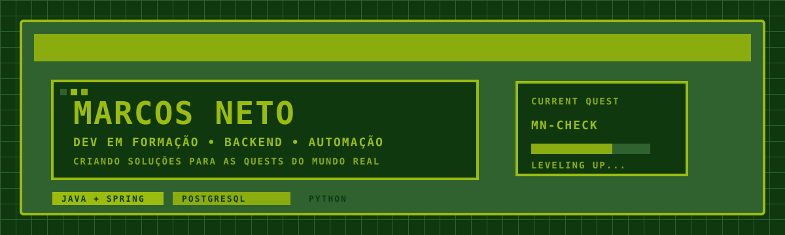

<p align="center">
  
</p>

<p align="center">
  <a href="https://portfolio-marcos-neto.vercel.app"></a>
  <a href="https://github.com/Neto-Marcos/mn-check"></a>
  <a href="https://github.com/Neto-Marcos/chronos-landing-page"></a>
</p>

## 🕹️ Player 1: Marcos Neto

Dev em formação, construindo sistemas web, automações e soluções para problemas que existem fora da tela. Gosto especialmente de transformar processos enrolados em fluxos simples — menos *game over* na operação, mais fase concluída.

```text
STATUS        ▶ criando, estudando e depurando com café
CLASSE        ▶ backend / automação / sistemas web
SKILLS        ▶ Java, Spring Boot, PostgreSQL, JavaScript e Python
MISSÃO ATUAL  ▶ evoluir o MN-Check
```

## ⭐ Fases em destaque

<table>
  <tr>
    <td width="58%">
      <h3>MN-Check</h3>
      <p>Um sistema para conferência, separação, contagem e acompanhamento de divergências em operações de expedição.</p>
      <p>Na prática: ajuda a operação a manter o placar limpo, com menos retrabalho e mais controle.</p>
      <a href="https://github.com/Neto-Marcos/mn-check">▶ Jogar esta fase</a>
    </td>
    <td width="42%" align="center">
      <a href="https://github.com/Neto-Marcos/mn-check">
        
      </a>
    </td>
  </tr>
</table>

<table>
  <tr>
    <td width="58%">
      <h3>Chronos</h3>
      <p>Landing page de uma plataforma de gestão de jornada, com reconhecimento facial, banco de horas e operação multiempresa.</p>
      <p>A missão aqui é comunicar um produto completo de um jeito direto, responsivo e pronto para o mundo real.</p>
      <a href="https://github.com/Neto-Marcos/chronos-landing-page">▶ Jogar esta fase</a>
    </td>
    <td width="42%" align="center">
      <a href="https://github.com/Neto-Marcos/chronos-landing-page">
        
      </a>
    </td>
  </tr>
</table>

## 🎒 Inventário

<p align="center">
  
  
  
  
  
  
  
</p>

## 📊 Placar

<p align="center">
  
  
</p>

<p align="center">
  
</p>

## 📡 Continue?

<p align="center">
  <a href="https://www.linkedin.com/in/marcos-neto-bbab573b6/"></a>
  <a href="mailto:marcos.neto0706@gmail.com"></a>
  <a href="https://www.instagram.com/lb.netin/"></a>
</p>
